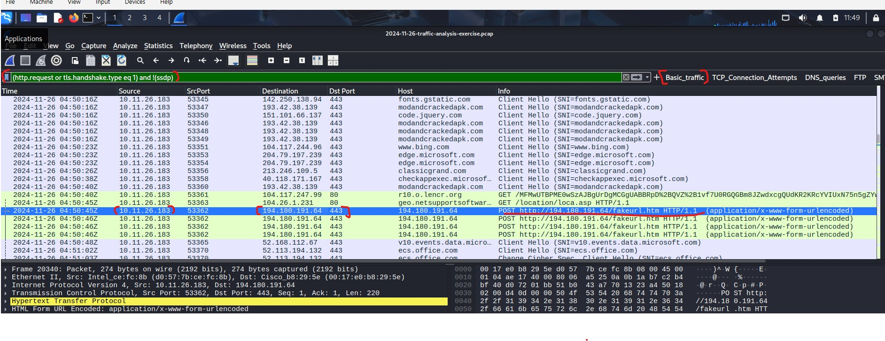
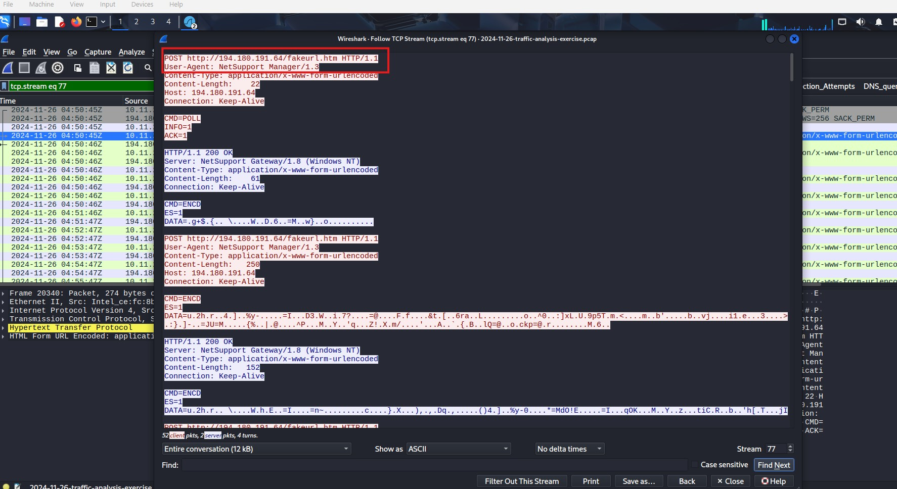
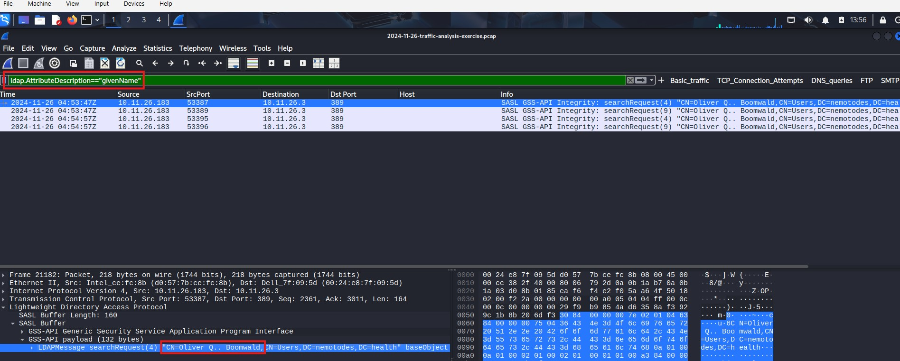
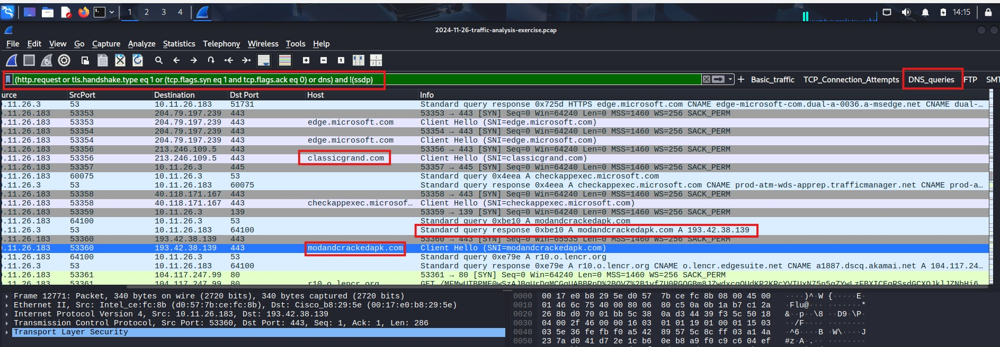
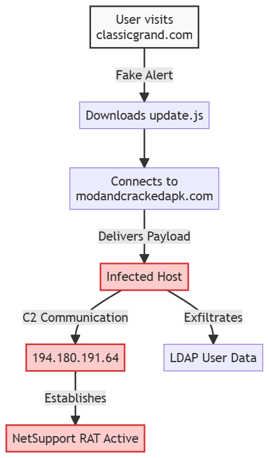

## Network-traffic-analysis
This project is based on analyzing window host to identify the **RAT** infection. by leveraging wireshark custom profiles and advanced filters.

---

### Lab Environment
**Tools**: Wireshark, OSINT(virusTotal)

**Dataset**: 2024-11-26-traffic-analysis-exercise.pcap

**Protocol Analyzed**: HTTP/HTTPS, DNS, LDAP, TCP/IP

### Investigation Phase 1 Traffic Normalization and Surface analysis
- **Goal**: reduce traffic noise and identified host and primary C2 infrastructure
- **Action**: applied a custom *Basic web filter* to remove **SSDP** which increase noise
  - `(http.request or tls.handshake.type eq 1) and !(ssdp)`
- **Discovery**: identified victim host `10.11.26.23` communicating with suspicious ip `194.180.191.64` via POST requests to `fakeurl.htm`

> The wireshark interface is customized profile from columns to filters options above.
> The ip address `194.180.191.64` came from the dataset exercise which show the host infected by NetSupport RAT.
- By review the header, we can confirm the suspicious IP address and the user agent string, *Netsupport Manager*  if the organization does not use this service(Netsuppport), you can suspect to be malicious activity
- if you got `https://www.virustotal.com/gui/home/url` and paste the ip addressurl fake htm you found more info about this malware

### Investigation Phase 2 Host & User Identification
- **Goal**: collerate network activity to a specific user identity within the AD
- **Action**: analyzed LDAP features to find a`givenName` associated with internal traffic.
  - `ldap.AttributeDescription == "givenName"`
-**Discovery**: the compromised account was **Oliver Boomwald**

### Investigation Phase 3 C2 Pattern Analysis &m IOC Extraction
- **Goal**: Reconstruct the infection chain and extract high-fidelity indicators for blocklisting.
- **Action**: Followed TCP streams of encrypted and unencrypted HTTP traffic to analyze User-Agent Strings and Payload delivery.
- **Discovery**: *User-Agent*: `NetSupport Manager` confirmed in this context
  - **Infected vector**: Traffic  emerged from `modandcrackedapk.com` immediately preceding the C2 call-out, indicating *"Update Edge"* Script

 > Oliver open the classicgrand.com which prompt fake browser alert update, if you got virustotal and paste the website it is certainly malicious.
### Attack Cycle

### MITRE ATT&CK Mapping
|Tactic|Technique ID|Technique Name|
|------|------------|--------------|
|**Initial Access**|T1189|Drive-by Compromise (Fake Browser Update)|
|**Command and Control**|T1071.001|Application Layer Protocol: Web Protocols|
|**Discovery**|T1087.002|Account Discovery: Domain Account (LDAP)|
